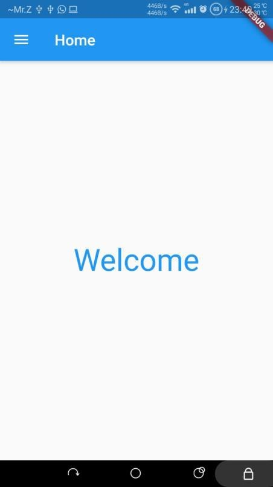
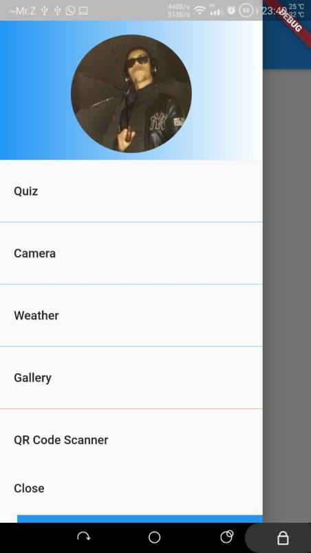
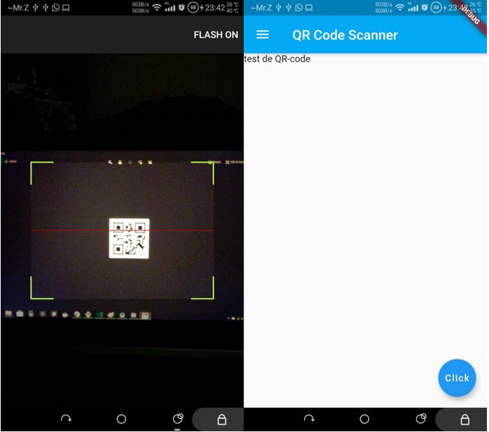
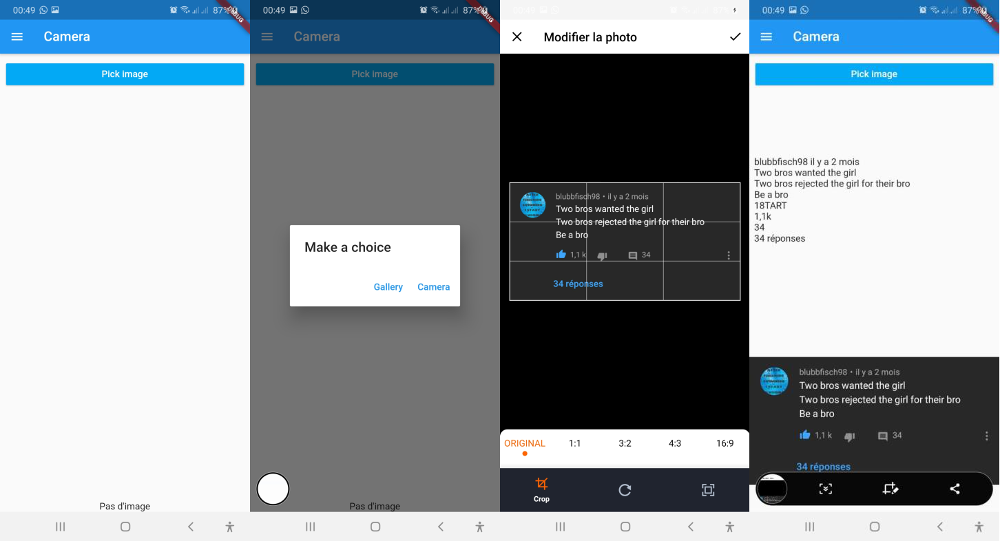
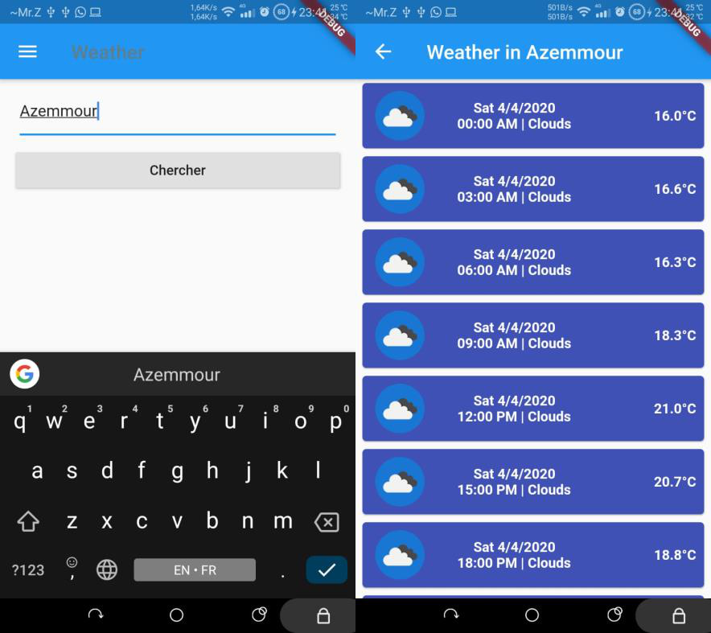
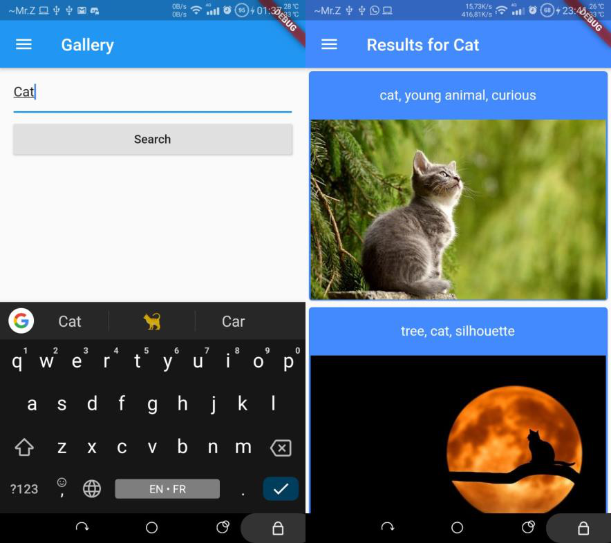
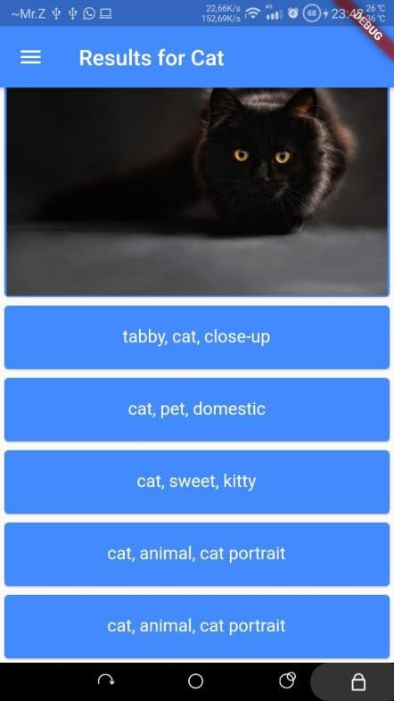
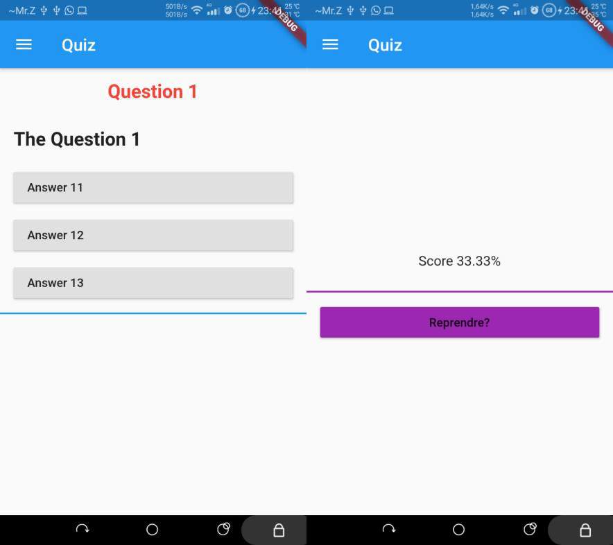

# a Hello World Flutter project!

This is my first flutter project. Check the screenshots down. In this project, I fiddled with many components. The result is this app that contains the following functionnalities:

- a drawer
- a QR code scanner
- text rcognition using firebase
- Image search using Pixabay API
- Weather forecast
- A little quiz game
  A new Flutter project.

## Screenshots

1. Simple Welcome page
   
2. Drawer
   
3. QR code scanner
   
4. Text recognition
   
5. Weather forecast
   
6. Image Search
   
   
7. Quiz
   

## Getting Started

This project is a starting point for a Flutter application.

A few resources to get you started if this is your first Flutter project:

- [Lab: Write your first Flutter app](https://flutter.dev/docs/get-started/codelab)
- [Cookbook: Useful Flutter samples](https://flutter.dev/docs/cookbook)

For help getting started with Flutter, view our
[online documentation](https://flutter.dev/docs), which offers tutorials,
samples, guidance on mobile development, and a full API reference.
